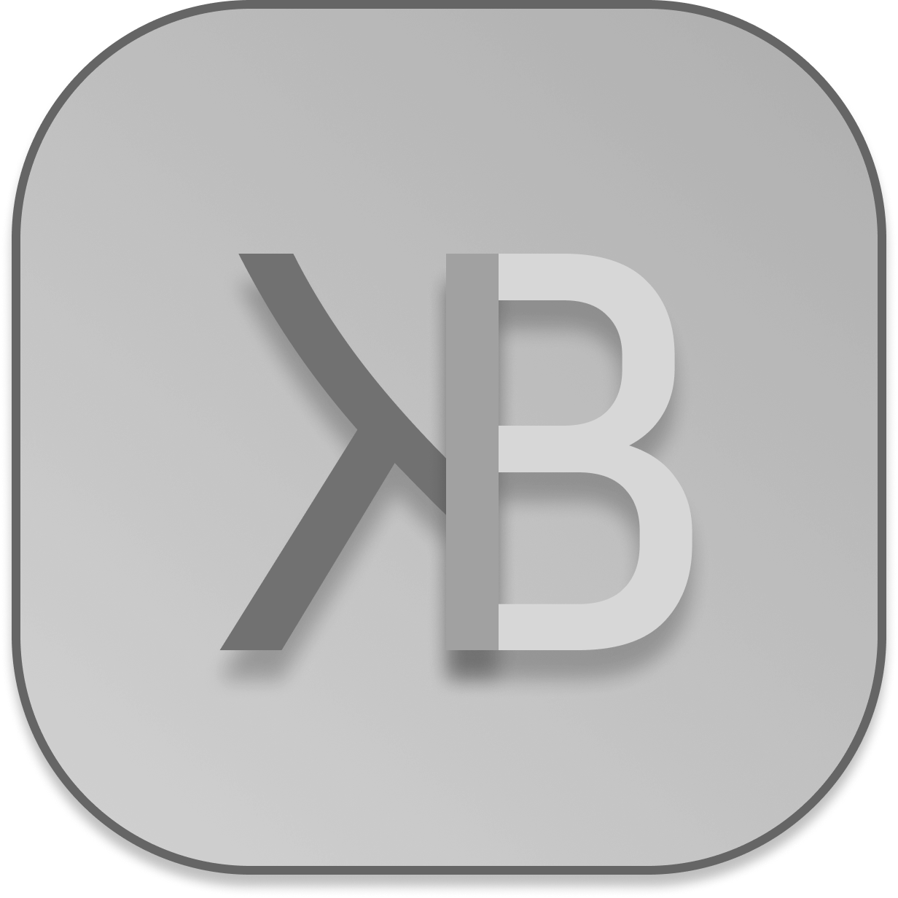

# 🏦 KedraBank — Цифровий комфорт у світі Kherson

**KedraBank** — це інноваційна платформа для управління ігровими активами та надання кредитних лімітів користувачам усередині екосистеми Kherson (Roblox). Проєкт поєднує в собі футуристичний дизайн, інтеграцію з Discord API та зручний інтерфейс для позичальників.

## 🚀 Основні можливості
* **Discord OAuth2:** Авторизація в один клік через ваш Discord-аккаунт.
* **Інтерактивна картка:** 3D-візуалізація банківської картки з динамічним нахилом.
* **Система заявок:** Автоматичне надсилання запитів на кредит через Webhooks прямо до робочого чату банку.
* **Особистий кабінет:** Відстеження балансу, статусу кредиту та історії операцій у реальному часі.
* **Тарифікація:** Прозора система відсоткових ставок (0.5% на добу) та термінів погашення.

## 🛠 Технології
* **Frontend:** HTML5, CSS3 (Custom 3D Transforms), Tailwind CSS.
* **Backend Logic:** Vanilla JavaScript (ES6+ Modules).
* **Database:** JSON-based cloud storage (GitHub sync).
* **Integration:** Discord API (Webhooks & Identity).

## 📄 Юридична інформація
Усі права захищені. Використання коду та ресурсів регулюється внутрішньою політикою безпеки:
* **License:** Вказана у файлі LICENSE.
* **Privacy Policy:** Доступна у відповідному розділі репозиторію.
* *Примітка: Файли ліцензії та політики охорони є остаточними та не підлягають зміні без узгодження з адміністрацією.*

## 👥 Команда проекту
* **Owner/Customer:** @Bondpley
* **Developer:** @xeraze

---
© 2026 KedraBank. Побудовано для спільноти Kherson, Ukraine.
